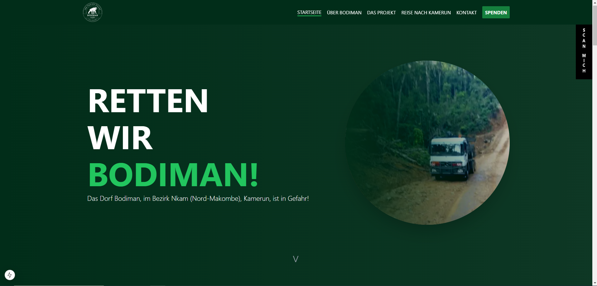
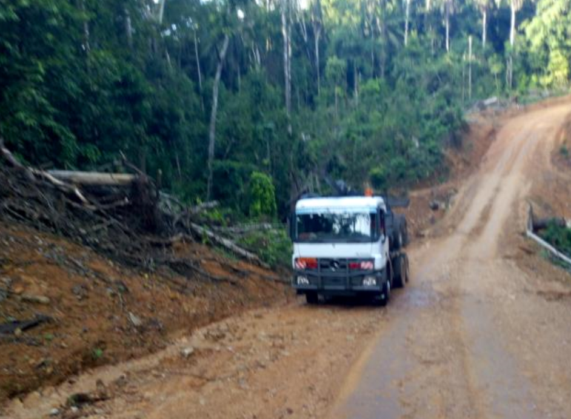

# 🌍 Rettet Bodiman – Hilf uns, das Dorf zu retten!  

  

## 🏡 Über das Projekt  

Das Dorf **Bodiman** in Kamerun ist bedroht: Eine multinationale Firma will das Land übernehmen, da viele Einheimische in die Stadt gezogen sind.  
Unsere Mission: **5 Häuser mit gebrannten Lehmziegeln bauen**, um das Dorf offiziell zu erhalten!  

> **Unser Ziel: 25.000€ über GoFundMe sammeln!**  
> 👉 [**Jetzt spenden!**](https://gofund.me/66defb2b)  

---

## 📸 Bilder aus Bodiman  

  
*Das wunderschöne Dorf Bodiman – Lass es uns gemeinsam retten!*  

---

## 🔧 Installation & Nutzung  

Falls du das Projekt weiterentwickeln möchtest, kannst du es lokal aufsetzen:  

```bash
git clone https://github.com/makombengas/rettet-bodiman.git  
cd rettet-bodiman  
npm install  
npm run dev  
